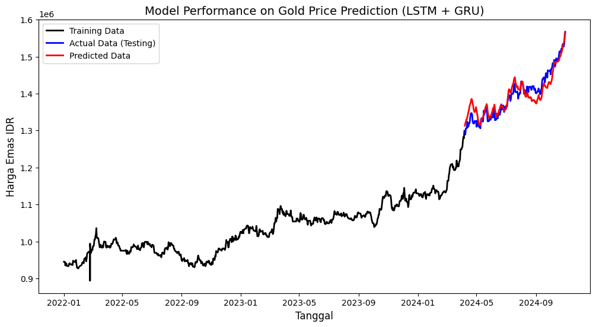
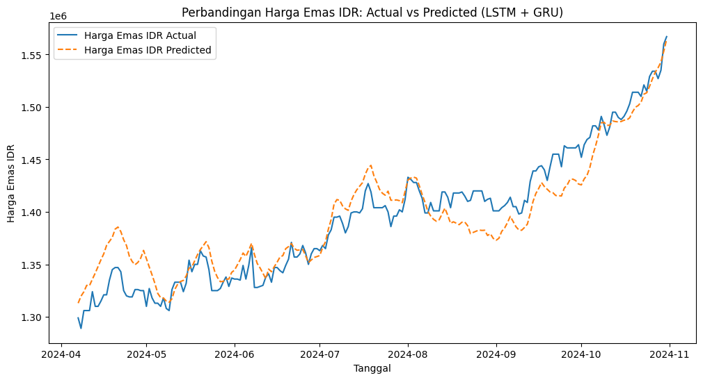

# Gold Price Forecasting Using Hybrid LSTM-GRU

## Overview
This project aims to forecast gold prices in Indonesia using deep learning techniques. A Hybrid LSTM-GRU model was developed and compared with standalone LSTM and XGBoost models to identify the most effective approach for gold price prediction.
The forecasting process incorporates multiple macroeconomic indicators, including inflation rates, interest rates, exchange rates, and the US Dollar Index, to improve predictive performance.

## Objectives
- Forecast future gold prices using machine learning and deep learning models.
- Analyze the impact of macroeconomic indicators on gold price movements.
- Compare the performance of LSTM, XGBoost, and Hybrid LSTM-GRU models.
- Generate insights that support data-driven financial analysis.

## Dataset
The dataset consists of historical gold prices and several macroeconomic indicators:
| Dataset | Description |
|----------|-------------|
| Harga Emas IDR | Historical gold prices in Indonesian Rupiah |
| Data Historis Emas Berjangka | Historical gold futures prices |
| Data Historis USD_IDR | Historical USD to IDR exchange rates |
| Data Historis US Dollar Index | Historical US Dollar Index (DXY) |
| Data Inflasi | Indonesian inflation rate |
| Suku Bunga BI | Bank Indonesia interest rate |
| Suku Bunga The Fed | Federal Reserve interest rate |
The datasets were collected from publicly available economic and financial sources.

## Technologies
- Python
- Pandas
- NumPy
- Scikit-Learn
- TensorFlow / Keras
- XGBoost
- Matplotlib
- Seaborn
- Keras Tuner

## Methodology

1. Data Collection
2. Data Cleaning and Integration
3. Exploratory Data Analysis (EDA)
4. Feature Engineering using Lag Features
5. Data Normalization using MinMaxScaler
6. Model Development
7. Hyperparameter Tuning
8. Model Evaluation
9. Forecast Visualization

## Models Evaluated
Three forecasting approaches were compared:
### 1. LSTM (Long Short-Term Memory)
A deep learning model designed to capture temporal dependencies in sequential data.
### 2. XGBoost Regressor
A machine learning ensemble model based on gradient boosting.
### 3. Hybrid LSTM-GRU
A hybrid deep learning architecture combining the strengths of LSTM and GRU layers to improve forecasting accuracy.

## Results
### Model Performance Comparison
| Model | MAE (IDR) | MAPE (%) | RMSE (IDR) | R² |
|---------|---------:|---------:|---------:|---------:|
| Hybrid LSTM-GRU | 17,402.97 | 1.25 | 21,130.82 | 0.88 |
| LSTM | 121,016.30 | 8.47 | 124,655.32 | -4.25 |
| XGBoost | 280,044.67 | 19.64 | 285,647.11 | -26.58 |

The Hybrid LSTM-GRU model achieved the best forecasting performance, producing the lowest prediction error and the highest coefficient of determination.
### Hybrid LSTM-GRU Performance

The model successfully captured the overall trend and fluctuations of gold prices during the testing period.

### Actual vs Predicted Gold Prices

The predicted values closely followed the actual observations, demonstrating the effectiveness of the Hybrid LSTM-GRU architecture for time-series forecasting.

## Key Findings
- Hybrid LSTM-GRU outperformed standalone LSTM and XGBoost models.
- The model achieved an RMSE of 21,130.82 IDR and an MAE of 17,402.97 IDR.
- The forecasting model obtained an R² score of 0.88, indicating strong predictive capability.
- Macroeconomic indicators contributed to improving forecasting performance.
- The model effectively captured both short-term fluctuations and long-term gold price trends.

## Author
Kanessa Jasmine  
